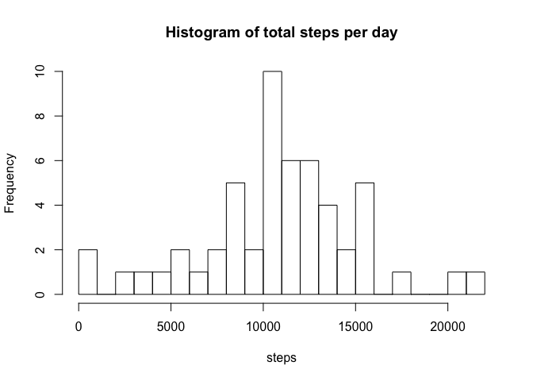
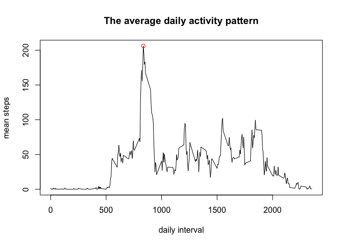
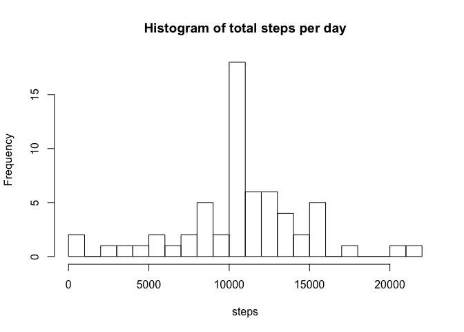

# Reproducible Research: Peer Assessment 1


## Loading and preprocessing the data

Loading data from activity.cs

```r
acts <- read.csv(unz("activity.zip", "activity.csv"))  
```

## What is mean total number of steps taken per day?

The total number of steps taken per day is:

```r
total_steps_per_day <- aggregate(steps ~ date, data=acts, sum)
```

Histogram of the total number of steps taken per day is:


```r
hist(total_steps_per_day$steps, breaks=25, xlab="steps", main = "Histogram of total steps per day")
```

 

The mean and the median of the total number of steps taken per day are:


```r
mean_total_steps <- mean(total_steps_per_day$steps)
mean_total_steps
```

```
## [1] 10766.19
```

```r
median(total_steps_per_day$steps)
```

```
## [1] 10765
```

## What is the average daily activity pattern?

The time series plot of the 5-minute interval (x-axis) and the average number of steps taken, averaged across all days


```r
avg_daily_pattern = aggregate(steps ~ interval, data=acts, mean)

plot(avg_daily_pattern$interval, avg_daily_pattern$steps, type="l", xlab="daily interval", ylab="mean steps", main="The average daily activity pattern")

idx <- order(avg_daily_pattern[, "steps"], decreasing=T)[1]

points(avg_daily_pattern[idx, "interval"], avg_daily_pattern[idx, "steps"], col="red")
```

 
The 5-minute interval, on average across all the days in the dataset, contains the maxium number of steps is 

```r
avg_daily_pattern[idx, ]
```

```
##     interval    steps
## 104      835 206.1698
```


## Imputing missing values
The total number of missing values in the dataset

```r
sum(is.na(acts$steps))
```

```
## [1] 2304
```

```r
nrow(acts[is.na(acts$steps), ])
```

```
## [1] 2304
```

The missing data is imput by the mean total steps, which is calculated before


```r
empty_acts <- acts[is.na(acts$steps), ]

for (i in 1:nrow(empty_acts)){
  empty_acts[i, ]$steps <- avg_daily_pattern[avg_daily_pattern$interval == empty_acts[i, ]$interval, ]$steps

  
}

new_acts <- rbind(acts[! is.na(acts$steps), ], empty_acts)
```

New histogram is

```r
total_steps_new_acts <- aggregate(steps ~ date, data=new_acts, sum)
hist(total_steps_new_acts$steps, breaks=25, xlab="steps", main = "Histogram of total steps per day")
```

 

```r
mean(total_steps_new_acts$steps)
```

```
## [1] 10766.19
```

```r
median(total_steps_new_acts$steps)
```

```
## [1] 10766.19
```

## Are there differences in activity patterns between weekdays and weekends?

new column for the data set

```r
new_acts$weekday <- weekdays(as.Date(new_acts$date))
new_acts$wdtype <- ifelse(new_acts$weekday == "Saturday" | new_acts$weekday == 
    "Sunday", "weekend", "weekday")
new_acts$wdtype <- factor(new_acts$wdtype, levels = c("weekday", "weekend"))
```

a plot


```r
gr <- aggregate(steps ~ interval + wdtype, data=new_acts, mean)
library(lattice)

xyplot(steps ~ interval | factor(wdtype), data=gr, aspect=0.5, type="l")
```

 
